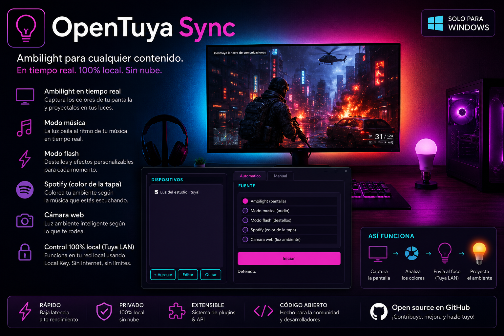

<p align="center">
  
</p>

<p align="center">
  <a href="README.md">English</a> | <b>Español</b>
</p>

# Llevá Ambilight a cualquier lámpara inteligente Tuya

OpenTuya Sync convierte tus lámparas Tuya / Ledvance en un sistema de luz
ambiente en tiempo real para Windows.

**100% Local. Sin nube. Código abierto.**

Arquitectura de plugins: varias **fuentes** de color (pantalla, audio,
flash, Spotify, cámara web) y varias **salidas** (Tuya y sus clones de
marca blanca, WLED, Hue), combinables libremente. Interfaz Qt con lista de
dispositivos y control manual de color, se minimiza a la bandeja del
sistema en vez de cerrarse.

## Demo

<p align="center">
  
</p>

<!--
  TODO: grabar ~10-15s de un juego/película con el foco real reaccionando
  al lado del monitor, convertirlo a GIF, y ponerlo en assets/demo.gif.
  GitHub renderiza GIFs animados directo en la página del repo — es lo que
  más impacto genera: mostrar el resultado en los primeros 5 segundos en
  vez de hacer que la gente lea para enterarse.
-->

## OpenTuya Sync vs. la app oficial

| | App oficial (Smart Life / Tuya) | OpenTuya Sync |
|---|---|---|
| Selección manual de color | ✅ | ✅ |
| Ambilight (sincroniza con pantalla) | ❌ | ✅ |
| Sincroniza con música | ❌ | ✅ |
| Luz ambiente por cámara web | ❌ | ✅ |
| Funciona sin cuenta en la nube | ❌ | ✅ |
| Requiere cuenta en la nube de Tuya | ✅ | ❌ |
| Código abierto | ❌ | ✅ |

## Funciones

- **Ambilight** — sigue el color de la pantalla en tiempo real (`dxcam`,
  funciona con juegos en pantalla completa exclusiva, con `mss` de
  respaldo).
- **Modo música** — reacciona a lo que suena por tus parlantes (loopback
  WASAPI), con auto-ganancia y detección de golpes de grave.
- **Modo flash** — destello configurable.
- **Spotify** — sigue el color de la tapa del disco que está sonando.
  Configuración única, hecha enteramente desde la app (sin terminal).
- **Cámara web** — luz ambiente según lo que ve tu cámara.
- **Control manual** — rueda de color HSV completa + slider de brillo,
  control directo como cualquier app de foco inteligente.
- **Control Tuya 100% local** — habla con el foco directo en tu red local
  usando su Clave Local, sin depender de la nube de Tuya para el uso
  diario.
- **Escaneo de red** — completa Device ID / IP / versión de protocolo
  automáticamente para dispositivos Tuya encontrados en tu red (la Clave
  Local no se puede recuperar así — ver [Agregar un dispositivo](#agregar-un-dispositivo)).
- **Límites de brillo por fuente** — poné un piso y un techo a qué tan
  tenue o fuerte puede llegar cada modo automático, editable en caliente
  mientras está corriendo (así podés bajarle a un pico de brillo en
  pantalla — un flashbang en un juego, por ejemplo — sin frenar el
  ambilight).
- **Salida Bluetooth** — soporta barras/tiras LED con protocolo
  ELK-BLEDOB/LotusLamp X (NBBUFF, Ledagic, clones parecidos) además de las
  salidas por WiFi.
- Bandeja del sistema, interfaz cyberpunk oscura, `.exe` standalone.

## Instalar y correr desde código

```bash
python -m pip install -r requirements.txt
python main.py
```

## Compilar el `.exe`

```bash
build.bat
```

Esto genera `dist\OpenTuyaSync\OpenTuyaSync.exe` con PyInstaller (modo
`--onedir`). Algunas cosas a tener en cuenta sobre el build:

- **No hace falta Python en la PC destino.** El intérprete de Python y
  todas las dependencias (PySide6, dxcam, OpenCV, numpy, tinytuya,
  soundcard, las DLLs del runtime de VC++...) quedan empaquetadas dentro
  de `_internal/`.
- **Copiá la carpeta `dist\OpenTuyaSync\` entera**, no solo el `.exe`. Es
  modo `--onedir`, no `--onefile` — el exe depende de archivos dentro de
  `_internal/`, al lado suyo.
- El `.exe` no está firmado digitalmente, así que es probable que Windows
  SmartScreen muestre un aviso de "editor no reconocido" la primera vez
  que corra en otra PC (`Más información` → `Ejecutar de todas formas`).
  No es un bug, es el costo de no tener un certificado de editor pago.
- Compilado y probado en Windows de 64 bits.

## Marcas compatibles

| Salida | Marcas | Estado |
|---|---|---|
| **Tuya** | Tuya, **Ledvance SMART+ WiFi**, LSC Smart Connect (Action), Nedis SmartLife, Mirabella Genio, Treatlife | Probado extensivamente contra un foco real — el foco usado en todas las pruebas de este proyecto es un **Ledvance WiFi** |
| **WLED** | Cualquier ESP8266/ESP32 con firmware WLED | **No probado** — no hay hardware disponible. Implementado según la API JSON oficial |
| **Philips Hue** | Bridge + luces Hue | **No probado** — no hay hardware disponible. Implementado según la API oficial |
| **ELK-BLEDOB (Bluetooth)** | Barras/tiras LED genéricas con la app "LotusLamp X", vendidas bajo nombres como NBBUFF, Ledagic, y clones parecidos de Amazon/AliExpress | **No probado** — no hay hardware disponible. A diferencia de las demás, acá no hay API oficial: sale de un protocolo reverseado por un tercero ([8none1/elk-bledob](https://github.com/8none1/elk-bledob)), no de documentación del fabricante. Bluetooth LE, no WiFi — se conecta por dirección MAC, tiene botón de escaneo en "Agregar dispositivo" |

Ledvance, Nedis, Mirabella, LSC y Treatlife son marcas blancas del mismo
protocolo Tuya — se agregan como dispositivo tipo "Tuya", con su propio
Device ID y Clave Local.

Ojo con el nombre Ledvance: la marca vende dos líneas de producto sin
relación entre sí. Los focos **SMART+ WiFi** (a los que apunta este
proyecto) hablan el protocolo Tuya directo por WiFi — sin hub aparte. La
línea **SMART+ Zigbee** es otra familia totalmente distinta, necesita su
propio bridge Zigbee, y **no** está soportada acá.

## Las cinco fuentes

| Fuente | Qué hace | Estado |
|---|---|---|
| **Ambilight** | Sigue el color de la pantalla. Usa `dxcam` (ve hasta juegos en pantalla completa exclusiva) con `mss` de respaldo | Probado con pantalla real, blanco y negro puros |
| **Música** | Sigue el audio que sale por tus parlantes (loopback). Auto-ganancia + detección de golpes de grave | Probado con audio real sonando en la PC |
| **Flash** | Destella a un ritmo elegible. No toca el relé real, alterna brillo dentro del modo color | Lógica probada, sin dispositivo físico destellando en la prueba |
| **Spotify** | Sigue el color de la tapa del disco sonando | **Requiere configuración propia** — ver abajo. La descarga+promediado de imagen está probada; la autenticación OAuth no (no había cuenta de desarrollador disponible durante las pruebas) |
| **Cámara web** | Sigue el color que ve una cámara (luz ambiente del cuarto) | Probado con cámara real conectada |

### Configurar Spotify (una sola vez)

Todo se hace desde la app ahora:

1. Elegí **Spotify** como fuente y apretá **Iniciar** — si todavía no está
   configurado, se abre solo un diálogo de configuración.
2. Andá a [developer.spotify.com/dashboard](https://developer.spotify.com/dashboard),
   creá una app gratis.
3. En "Redirect URIs" de esa app, agregá exactamente:
   `http://127.0.0.1:8888/callback`
4. Pegá el Client ID y el Client Secret en el diálogo y apretá
   **Autorizar con Spotify** — abre tu navegador, autorizás, y la app
   guarda todo en `config.json` sola.

(`spotify_auth_setup.py` sigue existiendo como alternativa por terminal,
pero no deberías necesitarlo.)

## Agregar un dispositivo

Botón "+ Agregar" en la ventana principal.

- **Tuya**: apretá **🔍 Escanear red** para completar Device ID, IP y
  versión de protocolo solo, con lo encontrado en tu red. La **Clave
  Local** sigue siendo manual — Tuya la genera del lado de la nube al
  emparejar y nunca se transmite de forma que un escaneo pasivo pueda
  leerla. Sacala de la app Smart Life (configuración del dispositivo →
  info del dispositivo). Mismos campos para las marcas blancas listadas
  arriba.
- **WLED**: sólo la IP.
- **Hue**: IP del Bridge, apretás el botón físico del Bridge y le das a
  **Emparejar** dentro de los 30 segundos, después elegís el ID de la luz.
- **ELK-BLEDOB (Bluetooth)**: apretá **🔍 Buscar por Bluetooth** para
  listar dispositivos BLE cercanos que se anuncien con nombre, o escribí
  la dirección MAC a mano si ya la sabés (por ejemplo, con la app nRF
  Connect). El escaneo muestra cualquier dispositivo BLE con nombre
  cerca, no solo esta marca — los clones varían en qué nombre anuncian.

Los dispositivos con el check tildado en la lista son los que reciben
color cuando arrancás una fuente. Podés tener varios dispositivos, de
distintas marcas, activos al mismo tiempo.

## Arquitectura de plugins

```
core/
  plugin_base.py   interfaces CaptureSource / OutputTarget
  color.py         matematica de color compartida (RGB, auto-ganancia, deteccion de golpes)
  engine.py        conecta una fuente activa con los dispositivos habilitados
  config.py        config.json con soporte para varios dispositivos

capture/
  dxcam_capture.py     pantalla
  music_capture.py     audio (loopback)
  flash_capture.py     destellos
  spotify_capture.py   tapa del disco
  webcam_capture.py    camara web

outputs/
  tuya_output.py        Tuya + marcas blancas
  wled_output.py        WLED
  hue_output.py         Philips Hue
  elk_bledob_output.py  ELK-BLEDOB / LotusLamp X (Bluetooth)
```

Agregar una fuente o salida nueva es un archivo nuevo + una línea en el
`registry.py` correspondiente — el resto del programa no necesita saber
que existe.

## Qué se verificó de verdad y qué no

Honesto, no marketing:

- **Tuya**: probado en profundidad — encendido/apagado, color, brillo,
  temperatura, modo escena, reconexión, de punta a punta a través de la
  GUI empaquetada como `.exe` contra la lámpara real.
- **Ambilight**: contraste probado con pantalla blanca y negra reales
  (llega a RGB puro 0,0,0 y 255,255,255). `dxcam` probado contra el
  escritorio (no un juego en particular).
- **Música**: probado con audio real sonando en la PC (no solo
  sintético), reaccionando con auto-ganancia y detección de golpes.
- **Cámara web**: probado con una cámara real conectada — captura,
  calcula color, se detiene limpio.
- **Spotify**: la parte de bajar y promediar el color de una imagen está
  probada con imágenes reales. La autenticación (OAuth, refrescar token,
  "qué está sonando") **no está probada** porque no había una cuenta de
  desarrollador de Spotify disponible durante las pruebas — necesita que
  la configures y verifiques vos.
- **WLED y Hue**: **no probados**, no hay hardware. Implementados según
  la documentación oficial de cada uno, pública y estable, pero eso no es
  lo mismo que confirmarlo funcionando. Avisen si algo no anda.
- **ELK-BLEDOB (Bluetooth)**: **no probado**, no hay hardware — y con más
  incertidumbre que WLED/Hue, porque acá no hay documentación oficial
  contra la cual implementar, solo el protocolo reverseado por un
  tercero. `bleak` (la librería BLE) sí se confirmó funcionando en
  Windows — el escaneo reporta correctamente "Bluetooth radio is not
  powered on" cuando el Bluetooth está apagado — pero ningún dispositivo
  real confirmó todavía que el protocolo de bytes funcione. Tu clon
  puntual puede usar otro UUID de característica u otro orden de bytes.
  Avisá cómo te fue, para bien o para mal.
- **Límites de brillo por fuente**: los sliders de mínimo/máximo, que
  cada fuente recuerde el suyo, la actualización en caliente mientras
  corre, y la matemática del recorte en HSV, están todos cubiertos por
  pruebas directas. Todavía no verificado contra un foco real
  reaccionando a un flash real de un juego.
- **La GUI y el .exe**: la ventana renderiza, carga los dispositivos de
  `config.json`, y el flujo completo (elegir fuente → Iniciar → la
  lámpara cambia → Detener → vuelve sola a como estaba) se verificó de
  punta a punta, y por separado se confirmó que el `.exe` compilado carga
  exactamente la misma interfaz. La bandeja del sistema (minimizar, ícono
  al lado del reloj) se creó sin errores, pero no se hizo clic real en el
  ícono durante la prueba.

## Notas

- No uses dos fuentes al mismo tiempo contra el mismo dispositivo (por
  ejemplo, esta app y otro controlador) — el que escribe último gana.
- El ícono (`assets/icon.ico`) es un placeholder generado por código, no
  un diseño real. Cambialo por el que quieras y recompilá.

## Licencia

[MIT](LICENSE)

---

<p align="center">Developed by Chemikl Project</p>
